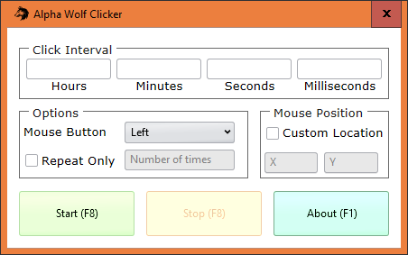

<h1 align="center">
  <a href="https://github.com/girkovarpa/alpha-wolf-clicker">
    
  </a>
  <br />
  <br />
  Alpha Wolf Clicker
  <br />
  <br />
</h1>

<h3 align="center">
  The leading auto-clicker for Windows.<br />Be ahead of the pack.
</h3>

<h1 align="center">
  <a href="https://github.com/girkovarpa/alpha-wolf-clicker">
    
  </a>
</h1>

Alpha Wolf Clicker is the leading auto-clicker for Windows.  This title was not granted by a third-party review — trail-blazers by nature, alpha wolves left reviewers behind long ago.  This title was self-bestowed by pure fiat.  

**Be ahead of the pack.**  Use Alpha Wolf Clicker.

## Building

```sh
cargo build
```

## Dependencies

- [sciter.dll v4.4.8.15](https://github.com/c-smile/sciter-js-sdk/blob/faeba319c38bac2e833cbf0fe5a6be60cf87a24e/bin/windows/x64/sciter.dll)
- AutoHotKey.exe v1.1.33.6 — *renamed to ahk.exe*